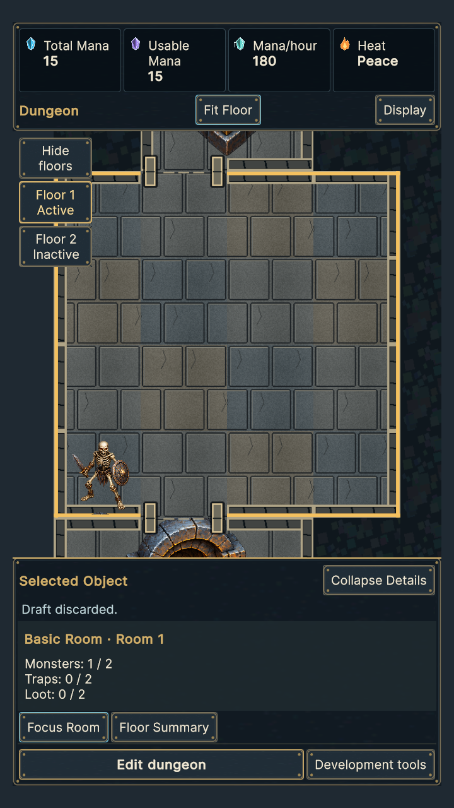
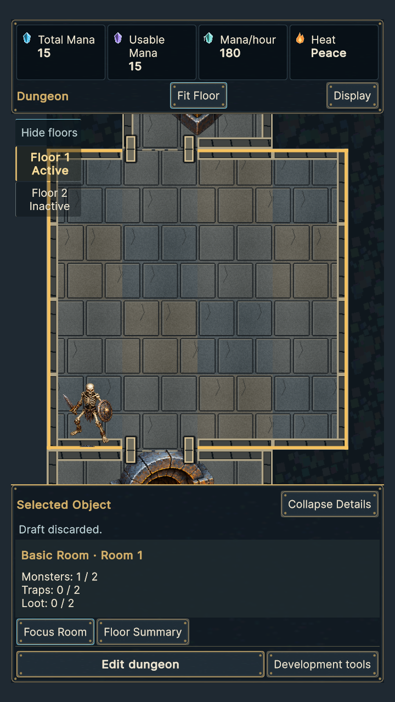
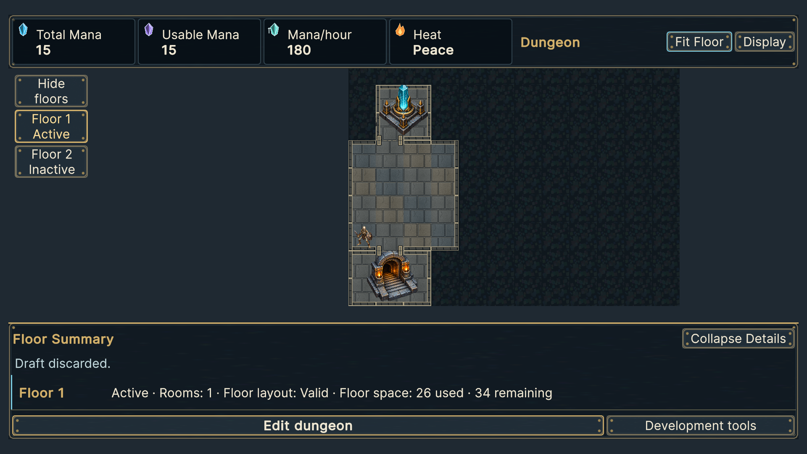
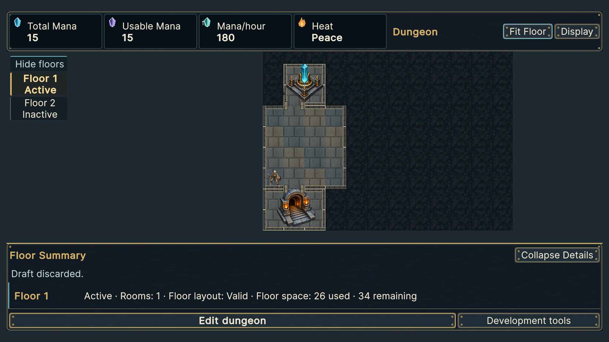
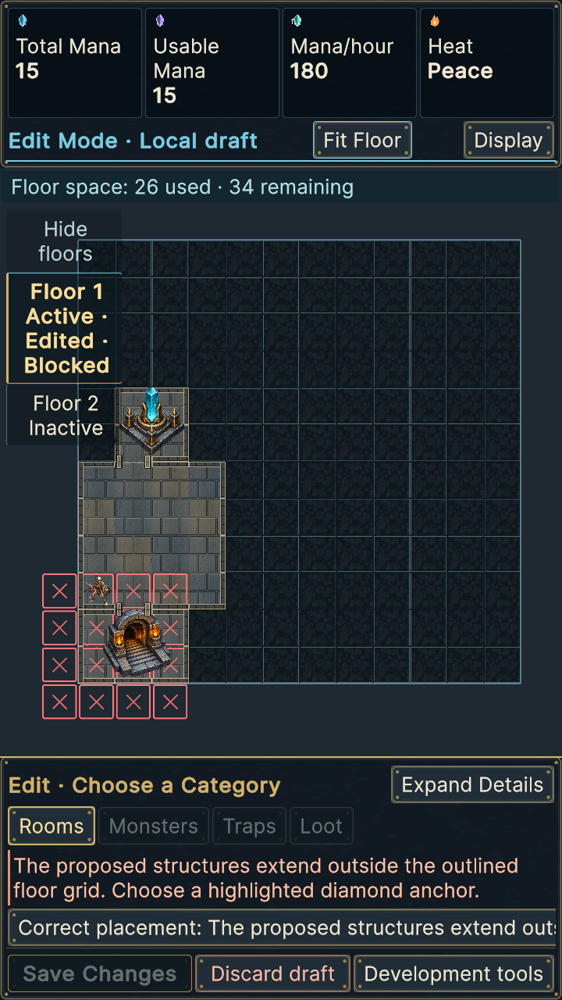
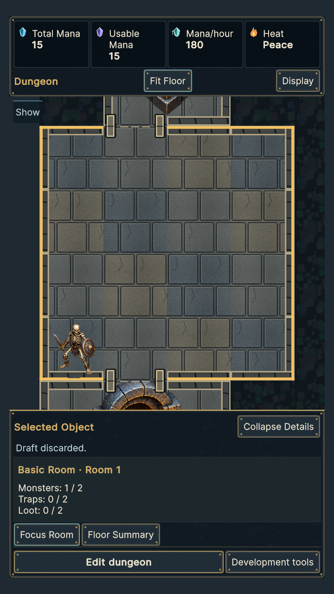

# Actual Unity floor HUD comparison

`before/`: **30** actual Unity frames captured with the reviewed `4d3ed8b` stylesheet/runtime and an added capture-only fixture. `after/`: the same authority-seeded fixture with the frozen `b85daa6` styling, regenerated by full qualification. Hashes are in `before-index.json` / `screenshot-index.json`. Portrait **720×1280**, landscape **1920×1080**, each Small/Default/Large. Normal/focused/collapsed views use simulated 20-pixel horizontal / 35-pixel vertical safe insets. Floor/mode changes restore the existing real Screen.safeArea (zero desktop insets); inactive/blocked views use that refreshed safe area. Controls are checked against the current safe root; retained overlay tests also exercise simulated insets at four resolutions/all sizes.

Filename states: `composition-floorhud-{normal,focused,collapsed,inactive,blocked}-{Small,Default,Large}-{resolution}.png`. Normal has two actual authored floors, Active and Inactive. Inactive capture selects that actual floor. Blocked capture uses a durable invalid construction intent in the disposable draft, showing Edited and Blocked text; it does not publish invalid geometry. Focus/collapse are presentation-only. Identical seeded wallet values are fixture results, never UI tuning or copied concept values.

Default-text after-capture viewport pixels with simulated insets: portrait Normal **680×727**, focused/collapsed **680×675**; landscape Normal **1880×604**, focused/collapsed **1880×438**. Collapse preserves the full-width viewport and camera while reducing overlay occlusion. Styling preserves rail width 128 units (156 Large), collapsed 72 (88 Large). Raw measurements and actual background alpha/hit rectangles are retained in the XML/report summary. Panel hit measurements are converted by the existing screen-to-panel scale for minimum 48-pixel accessibility assertions.

Default portrait over actual stone, before:

After:

Default landscape before:

After:

Large-text blocked state:

Collapsed state:

Focused images were reviewed before full suites: wall lip and stone texture remain visible beneath floor rows, selected edge/bold type remain obvious, text is opaque, former action-frame corner ornaments are absent and the world remains full width. Hover/focus backgrounds may be more prominent in captures following genuine input; background alpha budgets and actual hit rectangles are recorded in XML observations. No whole-control/text opacity reduction.
