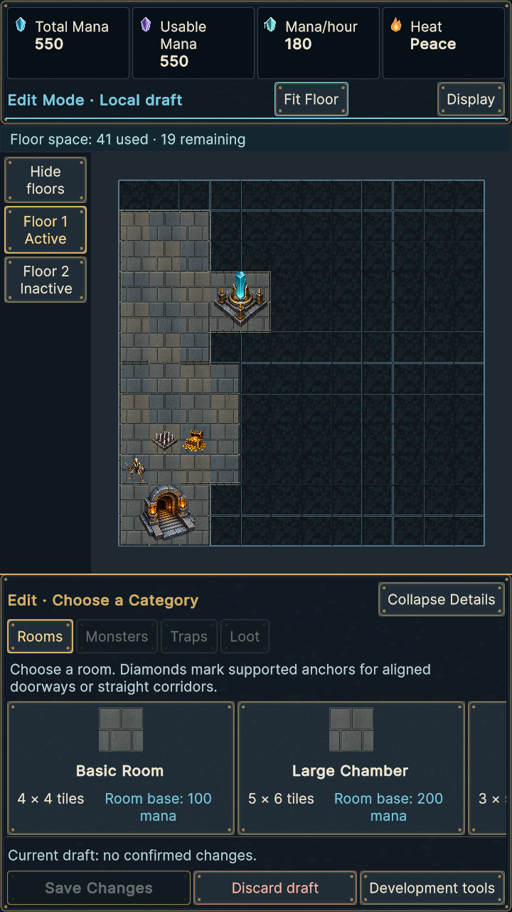
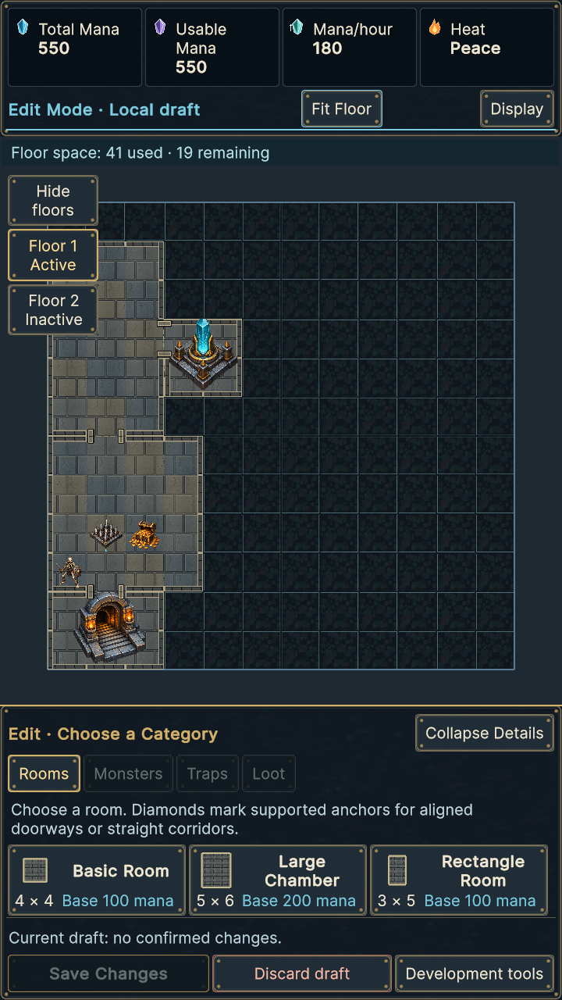
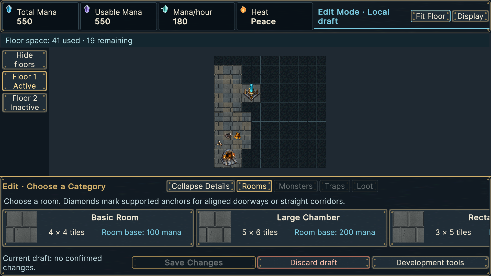
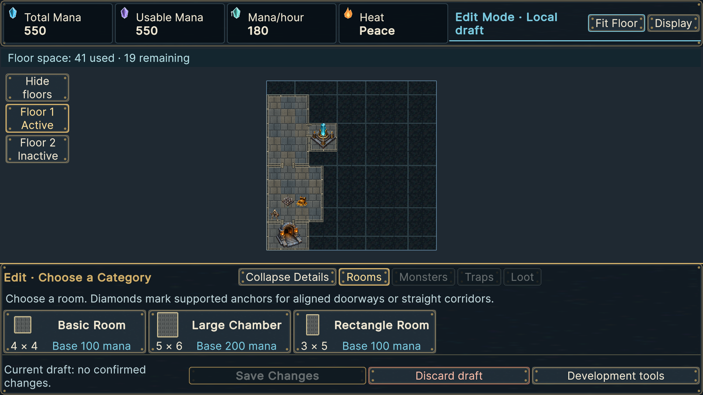
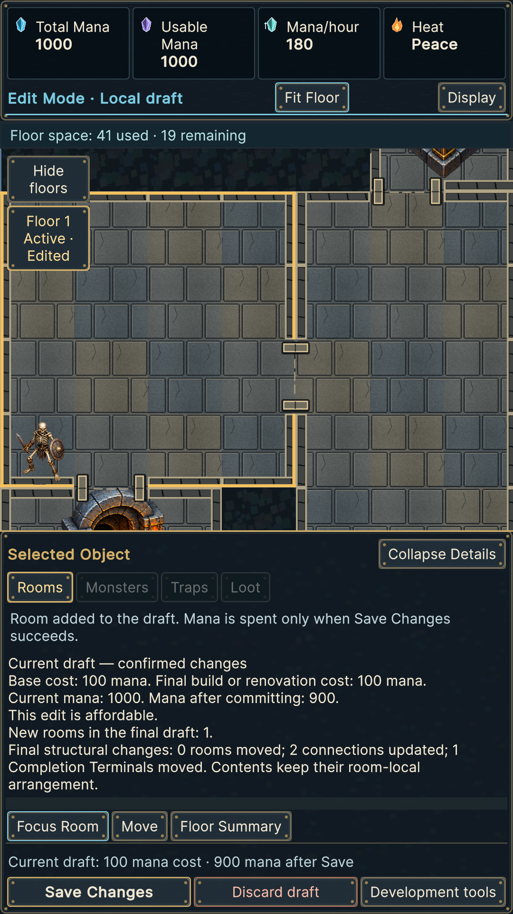

# Actual before/after Unity frames

`baseline-captures.zip`: 24 reviewed implementation frames captured before editing in the initially absent disposable project. `before/`: four representative originals. `after/` and `screenshot-index.json`: frozen implementation runtime frames and their hashes, copied after final qualification. No mockup or artwork-only render substitutes for a Unity screen.

## Equivalent seeded measurements

The paired `CompositionVisualCheckpoint` reports use the same two-floor/content/construction seed. Rectangles below are actual emitted camera viewport pixels; default text, expanded rail.

| Checkpoint | Reviewed viewport | Corrected viewport |
|---|---:|---:|
| Normal 720×1280 | 592×797 | 720×797 |
| Normal 1080×1920 | 888×1223 | 1080×1223 |
| Normal 1920×1080 | 1728×674 | 1920×674 |
| Edit rooms 720×1280 | 592×591 | 720×688 |
| Edit rooms 1920×1080 | 1728×504 | 1920×533 |

Collapse/expand preserves the full camera viewport; it reduces rail occlusion by 56 panel units (Large: 68). Previously the column reserved 128 Default / 156 Large units. New cutout tests assert full safe map width at four resolutions and all three sizes, e.g. 680 / 1040 / 1880 / 1496 pixels with 20-pixel left/right insets. Empty padding picks the world and supports genuine wheel/pan; controls intercept genuine touch/mouse without draft commands or canonical/mana changes.

Actual Default authored cards now measure **228×91** panel units in portrait and **260×79.33** in landscape. Reviewed widths were 320 / 500; PNG frame heights were approximately 188 portrait / 98 landscape (raster framing includes a small border inset). Width falls 29% / 48%; height is materially lower without reducing the existing 20-unit Default text or 48-pixel minimum hit target. Compare the original screens below with `overlay-cards-Default`. The old qualified long-name fixture had 320×260 portrait and 500×128 landscape cards; narrower new long-name cards wrap to 228×257 / 260×172.67, a documented readability tradeoff rather than clipped labels. XML preserves all Small/Default/Large card rectangles, regions and quotes. Long names may require vertical optional detail scrolling; horizontal scrolling reaches all options.

Thumbnail shapes come from actual resolved cells: Basic 16, Rectangle 15 and Chamber 30. At the shared Default scale their displayed footprint rectangles are approximately 29.33×29.33, 22×36.67 and 36.67×44 panel units respectively. Tests derive ratios/counts from definitions, not these example values. Imported room stone is reused; no baked English or thumbnail textures generated at runtime.

## Image index

Paired `composition-{normal,inspection,focused,edit-rooms,placement,invalid}-{resolution}.png` supplies equivalent baseline/new states. Supplemental `composition-overlay-*` captures provide expanded/collapsed navigation, selected room, cards at each size, legal/invalid placement and saved doorway/corridor overview/focus (Zero/Ninety orientation). `composition-overlay-touching-no-edge` is a detached presentation-only fixture, never canonical publication. Other UAT/corridor/large-label frames retain the existing fixture evidence. Exact filenames/hashes are in the index.

Before portrait room browsing:

After equivalent portrait room browsing:

Before landscape:

After equivalent landscape:

Focused open doorway:

Images were reviewed before full suites: world behind the overlay, visible masonry seams/open jambs, proportionally distinct compact previews, readable text/cost, consistent bottom sheet and separated placement/transaction actions. Reimport and full suites subsequently regenerate the same implementation's evidence. Physical mobile and owner manual retest remain pending.
