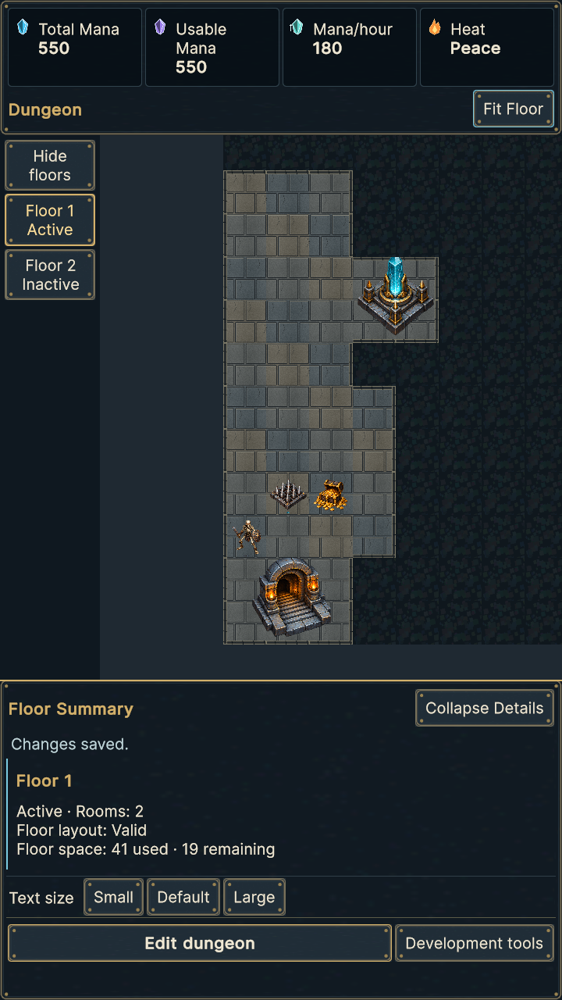
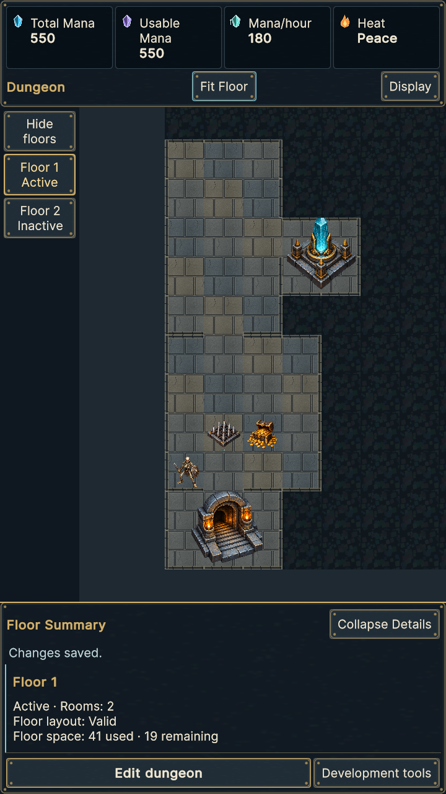
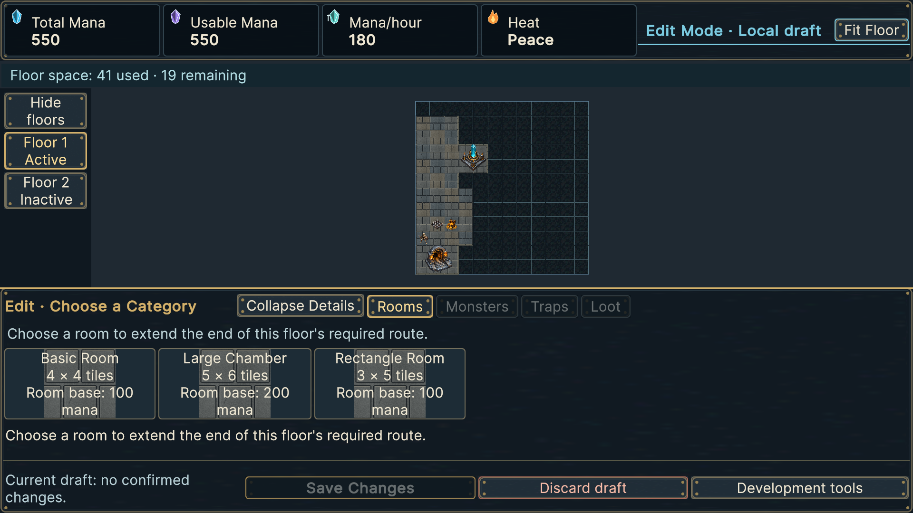
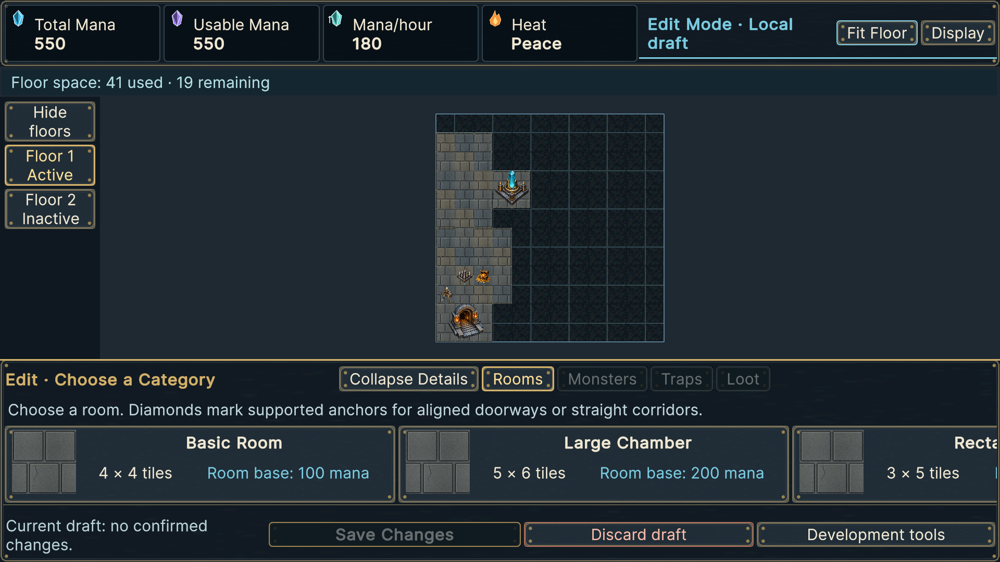

# Actual Unity captures and measurements

The baseline is reviewed HEAD `b273901aada22819e4933c66d162cccd1f268877`; new frames use implementation `691720b20e8226da0f110e5b44442a9d41be8407`. Same disposable authority-seeded production scene fixture. `baseline-captures.zip` preserves all 24 baseline PNGs; `before/` exposes three representative originals. `after/` contains 37 actual Unity frames with hashes in `screenshot-index.json`. No mockups/concept images replace implementation evidence.

## Viewport recovery

Default text, expanded rail. Before measurements come from exact baseline PNG chrome edges (map starts at pixel 173 portrait, 128 landscape Normal, 186 landscape Edit; gold sheet border begins at 870, 734, 605). After values are emitted by the runtime test's viewport rectangle. Raster borders can differ by one pixel from continuous panel coordinates.

| State / resolution | Before map pixels | After map pixels | Recovered map height |
|---|---:|---:|---:|
| Normal 720×1280 | 592×697 | 592×797 | **100 px** |
| Normal 1920×1080 | 1728×606 | 1728×674 | **68 px** |
| Edit category 1920×1080 | 1728×419 | 1728×504 | **85 px** |

Other runtime states: Normal 1080×1920 = 888×1223; selected room = 888×1154; Edit rooms = 888×921; placement = 888×1069; invalid = 888×1011. Landscape selected room = 1728×490; placement = 1728×608; invalid = 1728×550. Tablet 1536×2048 Large Normal = 1203×866. Collapsing the inspection sheet increases map height **745→887** pixels at 720 Default and **490→702** at 1920 landscape Default; Large gives **669→840** and **428→623** respectively. Expansion restores details; full XML retains all sizes, safe inset transitions and orientation measurements. Normal selection preserves zoom (6.325 in the seeded checkpoint). Edit Fit retains the legal overview (6.9), including all guidance anchors and recovery bounds. No automatic occupied-only framing/cropped legal placement area is introduced.

## Room cards and wheel

Long test-localized names, three actual options, all three text sizes at 720×1280, 1080×1920 and 1920×1080 are measured in the genuine PlayMode report. Coordinates below are UI Toolkit panel units. Artwork/name/size/cost regions are separate and bounded; horizontal scrolling intentionally reaches later cards. Critical placement/transaction actions are outside optional detail scrolling.

| First card / long-name fixture | Card size | Name top / height | Cost top / height |
|---|---:|---:|---:|
| Portrait 720 Default | 320×260 | 1002 / 105 | 1113 / 57 |
| Portrait 720 Large | 420×303 | 1018 / 134 | 1158 / 71 |
| Landscape Default | 500×128 | 521.33 / 80.67 | 608 / 32.67 |
| Landscape Large | 640×157.33 | 508.67 / 102.67 | 617.33 / 40 |

Landscape artwork occupies its own left region; portrait artwork is above the name. Cost and size remain calculated/localized from existing authorities; no illustrative concept prices or dimensions are used. Very long optional text can require scrolling.

Actual injected Input System wheel response from fit size 6.9: +0.1 → 6.747736; +1 → 5.52; +100 → minimum 2. Starting size 3.45: −0.1 → 3.52785; −1 → 4.3125; −100 → maximum fit 6.9. Fit Floor restores overview. Old normalized-notch zoom ratio 1.006270 becomes **1.25**, small delta ratio 1.022565; native Windows 120 is converted to one notch. Tests preserve pointer anchoring, camera limits and touch/mouse separation. Pinch/pan use their existing input path.

## Capture index

`composition-{normal,inspection,focused,edit-rooms,placement,invalid}-{720x1280,1080x1920,1920x1080,1536x2048}.png` supplies 24 normal player-composition frames (the tablet fixture uses Large text). The remaining frames show Large collapsed sheets, long cards, corridor overview/focus, Display popover and corridor inspection. All exact filenames/hashes are in `screenshot-index.json`.

Room boundaries are visible in the overview and corridor captures: individual lips persist where different rooms touch without a saved connection; authorized direct socket openings and straight corridor joins remain open, including selected outlines. Rotation and disconnected/adjacent cases are asserted against canonical footprints and saved-edge adapters. These are presentation sprites, with no collision/routing changes.

Before portrait Normal:

After portrait Normal:

Before landscape Edit:

After landscape Edit:

Visual review corrected excessive height and compact landscape spacing before full qualification. The dungeon remains a top-down plan with static first-treatment art; the full legal square still leaves horizontal surroundings at landscape overview. Focus/zoom provide detail. Manual owner retest remains required after external review.
